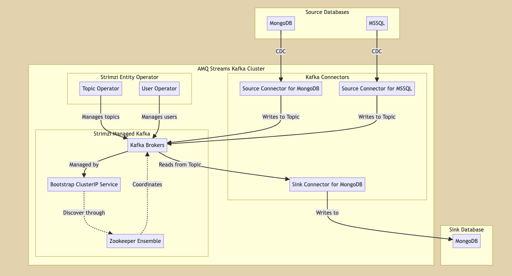

# amq-streams-kafka-connect



## Prerequisites:

Install the following operators
* AMQ Streams

Kafka Broker/Bootstrap/Zookeeper Cluster
* Assumes you already have AMQ Streams Strimzi Kafka Cluster running successfully

Source and Sink Databases
* Instruction steps below include how to provision these databases: MSSQL, MongoDB

To use the yaml examples in this lab:
* Replace <your-project> with your own project namespace
* Make sure kafka resources and cluster names match your project

External image registry and source repository access
* Make sure your environment allows your OpenShift cluster to reach out to external image registries and Maven repositories


## Apply the CRD resources in this order
```
KafkaConnect:
oc -n <your-namespace> apply -f yaml/kafka-connect/kafka-connect-metrics-example.yaml
oc -n <your-namespace> apply -f yaml/kafka-connect/kafka-connect.yaml
oc -n <your-namespace> apply -f yaml/kafka-connect/kafka-connector-mongodb-source-custom.yaml
oc -n <your-namespace> apply -f yaml/kafka-connect/kafka-connector-mongodb-sink.yaml

helm repo add bitnami https://charts.bitnami.com/bitnami

helm install mongodb bitnami/mongodb \
--set architecture=replicaset \
--set replicaCount=3 \
--set podSecurityContext.fsGroup="",containerSecurityContext.enabled=false,podSecurityContext.enabled=false,auth.enabled=false \
--version 13.6.0 \
-n <your-namespace>

```

## Post Installation Steps
Insert some data into the MongoDB.OrdersDB.raworders collection.

```
oc -n <your-namespace> exec -it <your-mongodb-pod> -- /bin/bash
use OrdersDB
show collections
db.raworders.insertOne({"Raw" : "Customer-AAA"})
db.raworders.insertOne({"Raw" : "Customer-BBB"})
```

Call the Custom Quarkus MongoDB Source Connector
```
curl -v "http://localhost:8088/mongo/holajson?dbname=ordersdb&collectionName=raworders"
```
Observe the workflow: OrdersDB.raworders collection-->Quarkus MongoDB Source Connector-->Orders Topic->MongoDB Sink Connector-->Ordersdb.orders collection
